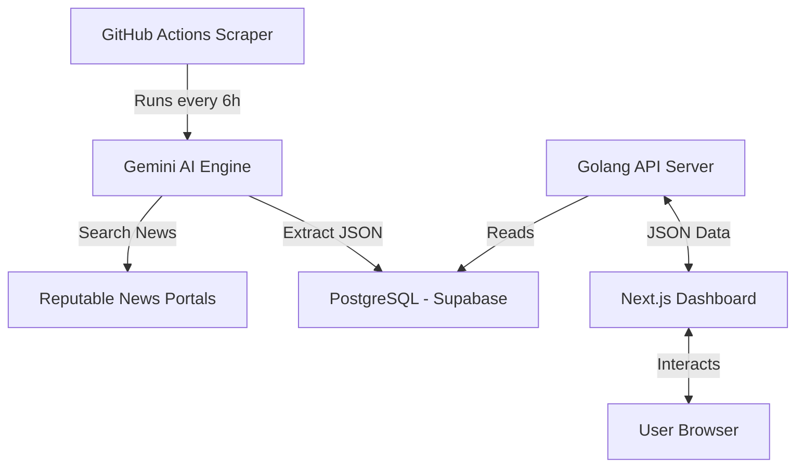

# Waspada Bandung 🛡️
### Automated Crime Monitor Dashboard

Waspada Bandung is an intelligent, real-time monitoring system designed to visualize crime incidents across 30 districts in Bandung City, Indonesia. This project was built to increase public awareness and transparency using modern web technologies and AI-powered data grounding.

---

## 🧩 The Story: How it was Built

This project is a showcase of **Agentic AI Workflow** and iterative development. It was built using a "Human-in-the-loop" prompting strategy.

### 1. The PRD (Product Requirement Document)
Everything started with a clear vision defined in [crime-dashboard.md](./crime-dashboard.md). This document served as the "Single Source of Truth" for features like:
- District-based statistics and map markers.
- Automated news scraping from reputable Indonesian news portals.
- Fully automated CI/CD for zero-maintenance operation.

### 2. The Iterative Loop (Prompt -> Debug -> Adjust)
The project evolved through a series of "Sprint Loops":
- **Sprint 1 (Structure)**: Initialized the Golang core and Next.js frontend scaffolding.
- **Sprint 2 (The AI Pivot)**: Originally intended for static scraping, the system was upgraded to use **Google Gemini 2.5 Pro**. This allowed for "Grounding with Google Search," making the scraper much more accurate at verifying news dates and locations.
- **Sprint 3 (Deep Debugging)**: Faced and solved real-world challenges like:
  - Gemini API limitations (JSON mode vs. Search tool conflicts).
  - Data integrity (preventing duplicate entries based on `source_url`).
  - Performance (handling database "Slow SQL" and cold starts on free tiers).

---

## 🛠️ Tech Stack

### Backend & AI
- **Language**: [Golang 1.24](https://go.dev/) (High-performance API)
- **Framework**: [Fiber](https://gofiber.io/) (Lightweight & fast)
- **Database**: PostgreSQL (Managed via **Supabase**)
- **ORM**: [GORM](https://gorm.io/)
- **AI Engine**: **Google Gemini 2.5 Pro** (Grounding & Data Extraction)

### Frontend
- **Framework**: [Next.js](https://nextjs.org/) (App Router)
- **Styling**: Vanilla CSS (Custom Glassmorphism UI)
- **Maps**: [Leaflet.js](https://leafletjs.org/) (OpenStreetMap)

### Infrastructure (Automated CI/CD)
- **Backend Hosting**: [Koyeb](https://www.koyeb.com/) (Dockerized deployment)
- **Frontend Hosting**: [Vercel](https://vercel.com/)
- **Background Worker**: GitHub Actions (Runs the scraper every 6 hours)

---

## 🔄 System Architecture

---

## 🚢 Deployment Guide

For a detailed walkthrough on how to deploy this system yourself using free-tier services, see our **[Deployment Guide](./deployment.md)**.

### Key Secrets Required:
- `DB_DSN`: PostgreSQL connection string.
- `GOOGLE_API_KEY`: Google AI Studio key for Gemini.
- `NEXT_PUBLIC_API_URL`: The URL of your live Backend API.

---

## 🔒 Security & Best Practices
- **Privacy**: All API keys and Database DSNs are managed via Environment Variables and GitHub Secrets.
- **Exclusion**: The `.gitignore` is strictly configured to ensure local `.env` files are never pushed to public repositories.
- **Deduplication**: The database uses a `UNIQUE` constraint on `source_url` to prevent "Double Scraping."

---

*Developed with ❤️ for the safety of Bandung citizens.*
